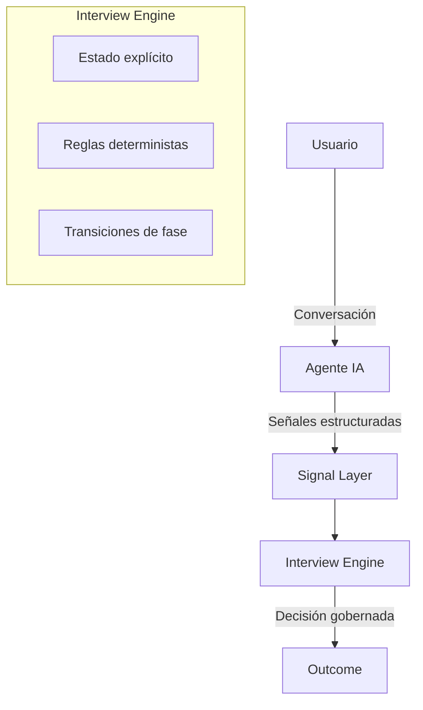

# AscendIA – Interview Engine

Motor de entrevistas asistidas por IA, **diseñado para ser determinista, testeable y auditable.**

  

## Qué es este repositorio

Este repositorio contiene una extracción técnica del núcleo lógico de **AscendIA**:  el **Interview Engine**.

No es una “app con IA”.  
Es un motor diseñado para **transformar interacciones conversacionales no deterministas en decisiones gobernables y reproducibles**.

El foco está en el sistema que rodea al modelo, no en el modelo en sí.

  

## Problema que aborda

Los modelos de lenguaje son inherentemente no deterministas.

Cuando se los coloca en el centro de flujos críticos (evaluaciones, entrevistas, decisiones profesionales), aparecen problemas estructurales:

- decisiones imposibles de reproducir
- falta de trazabilidad
- dificultad para testear escenarios complejos
- opacidad en los criterios de avance o cierre

Este engine aborda ese problema separando responsabilidades de forma explícita:

- **La IA genera señales**
- **El sistema gobierna las decisiones**

  

## Enfoque arquitectónico

El Interview Engine está diseñado como una **state machine cognitiva**, con:

- fases explícitas de entrevista
- estados bien definidos
- transiciones deterministas
- reglas de avance y cierre claras
- outcomes controlados por el sistema

La IA **no decide fases, resultados ni cierres**.  
Solo produce información estructurada que el sistema interpreta y valida.

### Diagrama del flujo arquitectónico

---
*Usuario -> Señales -> Engine -> IA Governada*

El modelo conversacional produce señales.
El Interview Engine interpreta esas señales dentro de un estado explícito
y decide de forma determinista cómo avanzar.

Las decisiones críticas no dependen del modelo,
sino del sistema que lo gobierna.

  

## Principios de diseño

- Determinismo por diseño
- Separación estricta entre señales y decisiones
- Testabilidad end-to-end sin depender del modelo real
- Arquitectura orientada a auditoría y evolución segura

Este enfoque introduce más estructura y más código.  
Pero **permite razonar, testear y evolucionar** el sistema sin depender de la “intuición” del modelo.

  

## Testing y MockAgentBridge

Uno de los pilares del engine es su estrategia de testing.

El agente conversacional real se abstrae detrás de un **AgentBridge**, lo que permite inyectar implementaciones mockeadas.

**MockAgentBridge** permite simular:

- señales estructuradas
- distintos niveles de confianza
- respuestas inconsistentes
- escenarios límite y fallos del modelo

Los tests no validan *qué dijo la IA*, sino:

- cómo reaccionó el sistema
- si avanzó de fase correctamente
- si esperó más evidencia
- si cerró la entrevista cuando correspondía

Esto convierte a un sistema con IA en algo **realmente testeable**.

  

## Qué incluye este repositorio

- Modelo del Interview Engine
- Definición de estados, fases y transiciones
- Signal Model (v1)
- Lógica de decisión determinista
- MockAgentBridge para testing
- Tests end-to-end del flujo de decisión
- Escenarios simulados representativos

  

## Qué NO incluye

Este repositorio **no** es la aplicación completa AscendIA.

Quedan fuera intencionalmente:

- UI
- autenticación
- persistencia en base de datos
- infraestructura de despliegue
- dashboards y métricas

El foco está exclusivamente en el **núcleo lógico y arquitectónico**.

  

## Estado del proyecto

- Versión: **v1**
- Estado: **estable**
- Uso: **núcleo del sistema AscendIA**

Este repositorio se publica como **caso de estudio técnico** y base para discusión arquitectónica.
Ss
  SSS
Ingeniero de Producto

Arquitectura server-first · IA gobernable · Sistemas deterministas

🔗 Repositorio: https://github.com/MarceM1/AscendIA-interview-engine

